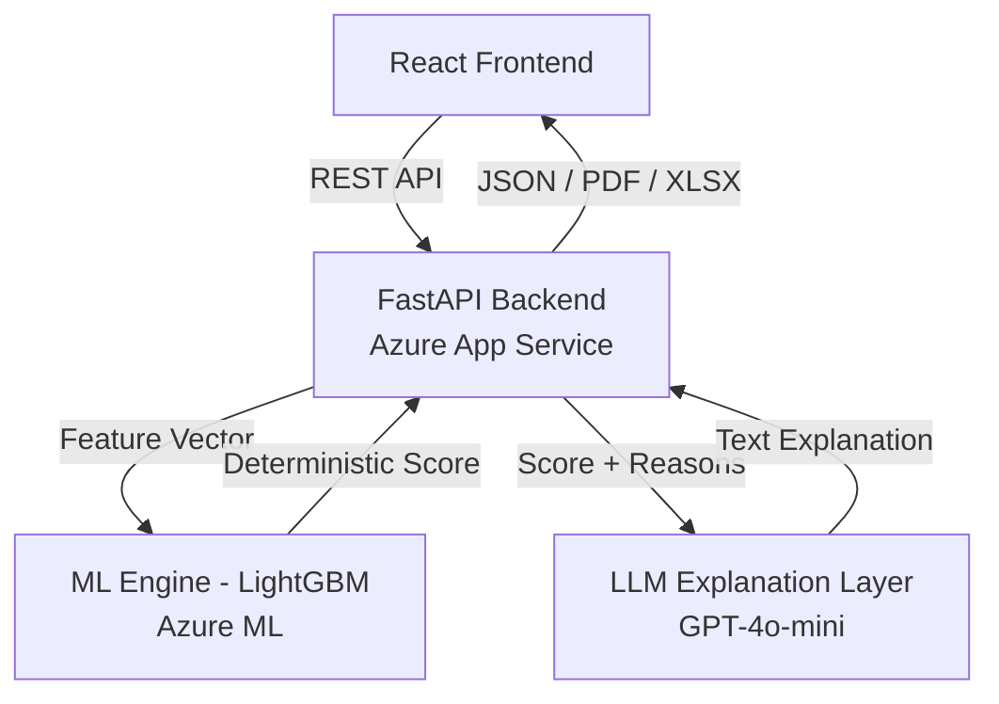
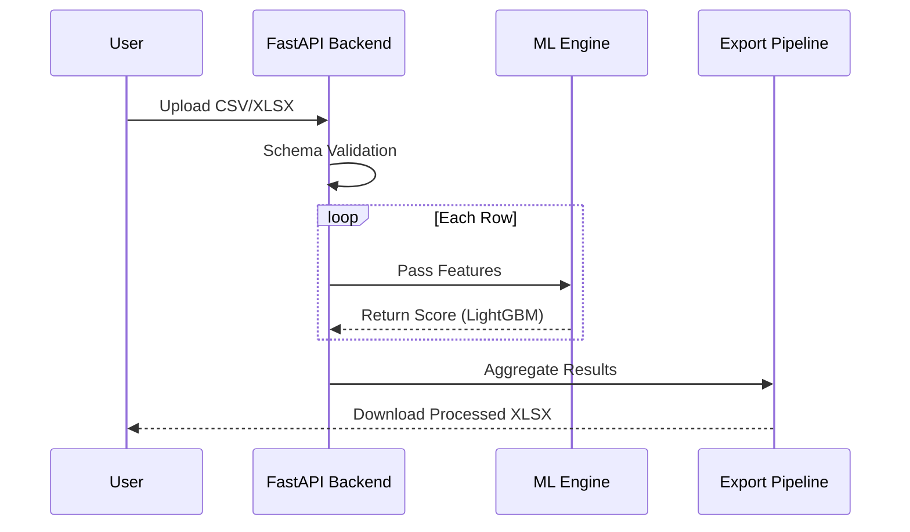

# CreditBridge

CreditBridge is an AI-powered credit intelligence platform for gig workers and informal entrepreneurs.
It converts raw income patterns into bank-grade, explainable credit scores using Azure Machine Learning.
This enables lenders to safely extend credit to the 1.5 billion people excluded by traditional systems.

## Project Overview
CreditBridge is an AI-driven credit assessment platform designed to foster financial inclusion for the underbanked and informal sectors. By moving beyond traditional credit history and utilizing alternative income data, CreditBridge provides a reliable, equitable, and transparent credit scoring mechanism for gig workers, freelancers, and small-scale entrepreneurs globally.

### Imagine Cup Framing
This project addresses the global challenge of **Financial Exclusion**. Millions of hardworking individuals are denied access to credit because they lack a formal banking history. CreditBridge leverages high-performance Machine Learning and Large Language Models to convert raw income patterns into bank-grade credit intelligence, empowering both borrowers and lenders.

## Why CreditBridge Is Different

- **We score income behavior, not paperwork** — gig workers and informal earners are evaluated on how they actually earn, not on salary slips.
- **We provide audited explanations, not black boxes** — every score is paired with ML-backed, regulator-safe reasoning.
- **We are built on Azure ML + Azure App Service**, making CreditBridge enterprise-ready, scalable, and compliant from day one.

## Why This Matters for the Microsoft Ecosystem

CreditBridge is built as a cloud-native AI system on Microsoft Azure, using production-grade services that support scalability, security, and responsible AI development.

### Microsoft Services Used
- **Azure Machine Learning**  
  Used for training, versioning, and managing the LightGBM credit risk model. This ensures reproducibility, controlled experimentation, and a clear path toward regulated ML workflows.

- **Azure App Service**  
  Hosts the FastAPI backend that exposes scoring, bulk processing, and export APIs. This enables scalable, managed deployment without custom infrastructure overhead.

### Supporting Azure Infrastructure
- **Azure Storage Account** – Stores model artifacts and datasets via Azure Machine Learning.
- **Azure Key Vault** – Manages secrets and API keys securely without hardcoding credentials.
- **Application Insights / Log Analytics** – Provides observability and runtime monitoring for the backend service.

> **Note:** Azure OpenAI is not currently used due to student program constraints. However, the LLM layer is intentionally abstracted, allowing a seamless transition to Azure OpenAI in future enterprise deployments.

---

## Problem Statement

### Credit Invisibility
Traditional credit scoring models rely heavily on historical debt repayment and fixed monthly salaries. This system systematically excludes:
- **Gig Economy Workers**: Irregular income streams that don't fit standard banking templates.
- **Informal Sector Entrepreneurs**: Individuals with high work consistency but no formal salary slips.
- **Underbanked Populations**: Those in developing regions where formal credit infrastructure is limited.

### Limitations of Traditional Scoring
Traditional models are often "black boxes" that fail to account for the resilience and consistency shown in alternative work patterns, leading to high rejection rates for viable applicants.

---

## Solution Overview

CreditBridge provides a dual-interface assessment system:
1.  **Single Applicant Analysis**: A high-fidelity, interactive dashboard for individual credit case reviews.
2.  **Bulk Dataset Scoring**: A batch processing pipeline for lenders to evaluate entire portfolios via CSV or Excel uploads.

By maintaining an intentional separation between decision logic and communication, CreditBridge ensures technical integrity. The **ML Engine** handles the deterministic scoring logic, while the **LLM Layer** handles natural language explanation, creating a system that is both mathematically sound and human-transparent.

---

## Key Features

- **Single Applicant Credit Assessment**: Targeted evaluation with immediate visual feedback.
- **Bulk Dataset Credit Scoring**: Scalable processing for high-volume lending environments.
- **ML-Driven Reliability Score**: Predictive scoring using a LightGBM model trained on income stability features.
- **LLM-Generated Lender Explanations**: Human-centric summaries generated by GPT-4o-mini to assist credit officers.
- **Strict Schema Enforcement**: Disciplined data validation that rejects incomplete inputs to prevent bias and silent failures.
- **Enterprise-Grade Exports**: Professional PDF reports for individual records and XLSX summaries for batch assessments.

---

## System Architecture

CreditBridge is built with a decoupled, scalable architecture ensuring high availability and separation of concerns.

### High-Level Architecture


### Bulk Processing Flow


---

## ML Model Inputs (STRICT SCHEMA)

The CreditBridge ML Engine requires a specific set of features to ensure model integrity. **No default values are used**; missing or malformed data will explicitly block execution. This intentional constraint prevents biased scoring and ensures that the model only operates within its validated input space.

| Feature Name | Type | Description |
| :--- | :--- | :--- |
| `avg_daily_income` | Float | The mathematical average of daily earnings over the assessed period. |
| `income_std_dev` | Float | Standard deviation of daily income (Volatility Indicator). |
| `active_days_ratio`| Float | Percentage of days with recorded work activity (0.0 - 1.0). |
| `max_income_gap` | Integer | The longest continuous period (in days) without income detected. |
| `tenure_months` | Integer | Total duration of the applicant's working history in months. |
| `income_trend` | Float | Linear regression coefficient representing income growth or decline. |

---

## Tech Stack

- **Frontend**: React 19, Tailwind CSS, Shadcn UI, Lucide Icons.
- **Backend**: FastAPI (Python 3.9+), Uvicorn.
- **ML / Data**: LightGBM, Pandas, Scikit-learn, Joblib.
- **LLM / AI**: GPT-4o-mini via OpenRouter.
- **Exports**: ReportLab (PDF), OpenPyXL (Excel).

---

## API Overview

| Endpoint | Method | Description |
| :--- | :--- | :--- |
| `/score` | POST | Performs real-time ML scoring for a single applicant profile. |
| `/score/bulk` | POST | Accepts CSV/XLSX files for batch record processing. |
| `/export/pdf` | POST | Generates a formal individual credit assessment report (PDF). |
| `/export/xls` | POST | Generates a consolidated bulk assessment summary (XLSX). |

---

## Getting Started

### Prerequisites
- Python 3.9 or higher
- Node.js 18 or higher
- OpenRouter API Key

### Backend Setup
1. Navigate to `/backend`.
2. Create a virtual environment: `python -m venv venv`.
3. Activate venv: `source venv/bin/activate` (or `venv\Scripts\activate` on Windows).
4. Install dependencies: `pip install -r requirements.txt`.
5. Configure `.env`:
   ```env
   OPENROUTER_API_KEY=your_key_here
   ```
6. Start server: `uvicorn main:app --reload`.

### Frontend Setup
1. Navigate to `/frontend`.
2. Install dependencies: `npm install`.
3. Start development server: `npm start`.

> [!NOTE]
> **Demo Confidence**: This project is fully demo-ready and configured for rapid evaluation. The local environment can be provisioned and tested within minutes using the steps above.

---

## Deployment

### Backend Deployment (Azure App Service)
The FastAPI backend is deployed on **Azure App Service**, enabling managed scaling, HTTPS endpoints, and integrated monitoring.

- Environment variables are configured directly in Azure App Service settings.
- No secrets or API keys are committed to the repository.
- Application Insights is used for basic telemetry and error tracking.

### Model Lifecycle (Azure Machine Learning)
The LightGBM model is trained and versioned using **Azure Machine Learning**. The deployed backend loads a registered model artifact, ensuring strict alignment between training and inference.

### LLM Configuration
- The system currently uses **GPT-4o-mini via OpenRouter** for explanation generation.
- The LLM is **not involved in scoring or decision logic**.
- The architecture supports future migration to Azure OpenAI without changes to the ML pipeline.

### How Judges Can Test the System
- **Backend**: Available via deployed Azure App Service endpoint or runnable locally using FastAPI.
- **Frontend**: Can be run locally for demo purposes.
- **Bulk Testing**: Judges can upload CSV/XLSX files to validate batch scoring and export flows.

This project is demo-ready and intentionally scoped as an MVP, not a production lending system.

---

## Responsible AI & Ethics

- **Decision Support**: CreditBridge is designed as a decision-support tool for lenders, not a fully automated approval/denial system.
- **Transparency**: Every score is accompanied by the key reasons (e.g., "High income volatility") to ensure the process is not a "black box".
- **Accountability**: LLM outputs are strictly constrained by ML-derived reasons. The explanation layer is audited to ensure it cannot introduce unverifiable claims beyond the observed data, making the system enterprise-safe.
- **Fairness**: By using income-based features rather than demographic data, CreditBridge reduces inherent bias in credit assessment.

---

## System Boundaries & Claims

- CreditBridge is a **decision-support tool**, not an automated loan approval system.
- All credit scores are generated exclusively by the ML model.
- The LLM layer produces explanations only from ML-derived outputs and cannot introduce new factors.
- The system enforces a strict input schema and rejects incomplete or malformed data by design.

---

## Future Roadmap

- **Authentication**: Role-based access control for lenders and applicants.
- **Audit Logs**: Full traceability of every assessment for regulatory compliance.
- **Model Governance**: Automated retraining pipelines to prevent model drift.
- **Integration**: Pluggable connectors for major gig platforms (e.g., Uber, Upwork).

---

## Disclaimer
CreditBridge is a proof-of-concept credit assessment system. The scores and explanations provided are for demonstration and decision-support purposes only and do not constitute financial advice or a guarantee of creditworthiness.

---
© 2026 CreditBridge Project – Bridging the Gap in Global Credit.
